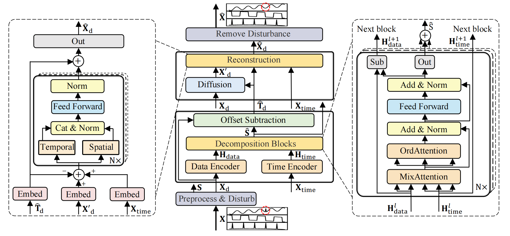
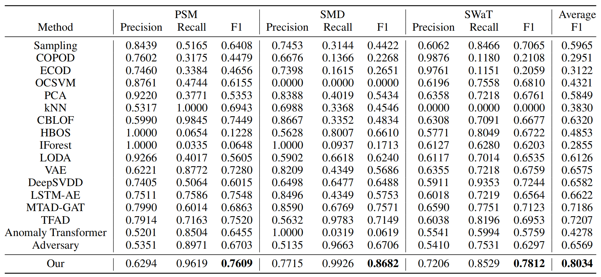

# D3R

**Drift doesn't Matter: Dynamic Decomposition with Dffusion Reconstruction for Unstable Multivariate Time Series Anomaly Detection**

<a href='https://proceedings.neurips.cc/paper_files/paper/2023/file/22f5d8e689d2a011cd8ead552ed59052-Paper-Conference.pdf'></a> 

Many unsupervised methods have recently been proposed for multivariate time series anomaly detection. However, existing works mainly focus on stable data yet often omit the drift generated from non-stationary environments, which may lead to numerous false alarms. We propose **D**ynamic **D**ecomposition with **D**iffusion **R**econstruction (D3R), a novel anomaly detection network for real-world unstable data to fill the gap. D3R tackles the drift via decomposition and reconstruction. In the decomposition procedure, we utilize data-time mix-attention to dynamically decompose long-period multivariate time series, overcoming the limitation of the local sliding window. The information bottleneck is critical yet difficult to determine in the reconstruction procedure. To avoid retraining once the bottleneck changes, we control it externally by noise diffusion and directly reconstruct the polluted data. The whole model can be trained end-to-end. Extensive experiments on various real-world datasets demonstrate that D3R significantly outperforms existing methods, with a 11% average relative improvement over the previous SOTA models.



## 	Get Started

1. Install Python 3.9.13, PyTorch 1.11.0.

2. Download data. You can obtain two benchmarks from [Google Cloud](https://drive.google.com/drive/folders/1UJ6SGfb6h-9R0L18FLDXpISKh1nhaqWA?usp=sharing). The datasets are well pre-processed. For the SWaT dataset, you can apply for it by following its [official tutorial](https://itrust.sutd.edu.sg/itrust-labs_datasets/dataset_info/). We unify the SWaT dataset to minute granularity and retain only continuous metrics:

   ```
   'AIT201', 'AIT202', 'AIT203', 'AIT401', 'AIT402', 'AIT501',
   'AIT502', 'AIT503', 'AIT504', 'DPIT301', 'FIT101', 'FIT201',
   'FIT301', 'FIT401', 'FIT501', 'FIT502', 'FIT503', 'FIT504',
   'FIT601', 'LIT101', 'LIT301', 'LIT401', 'PIT501', 'PIT502',
   'PIT503'
   ```

3. Train and evaluate. You can reproduce the experiment results as follows:

   ```shell
   bash ./script/run.sh
   ```

## Main Result

We compare D3R on three real-world datasets with 16 baselines and 1 adversary algorithm. Generally, D3R achieves the best F1 performance, confirming its effectiveness and superiority.



## Citation

If you find this repo or our work useful for your research, please consider citing the paper:

```tex
@inproceedings{
  author    = {Chengsen Wang and Zirui Zhuang and Qi Qi and Jingyu Wang and Xingyu Wang and Haifeng Sun and Jianxin Liao},
  title     = {Drift doesn't matter: Dynamic decomposition with diffusion reconstruction for unstable multivariate time series anomaly detection},
  booktitle = {Thirty-seventh Conference on Neural Information Processing Systems},
  year      = {2023},
}
```

## Contact

If you have any question, please contact [cswang@bupt.edu.cn](cswang@bupt.edu.cn).
